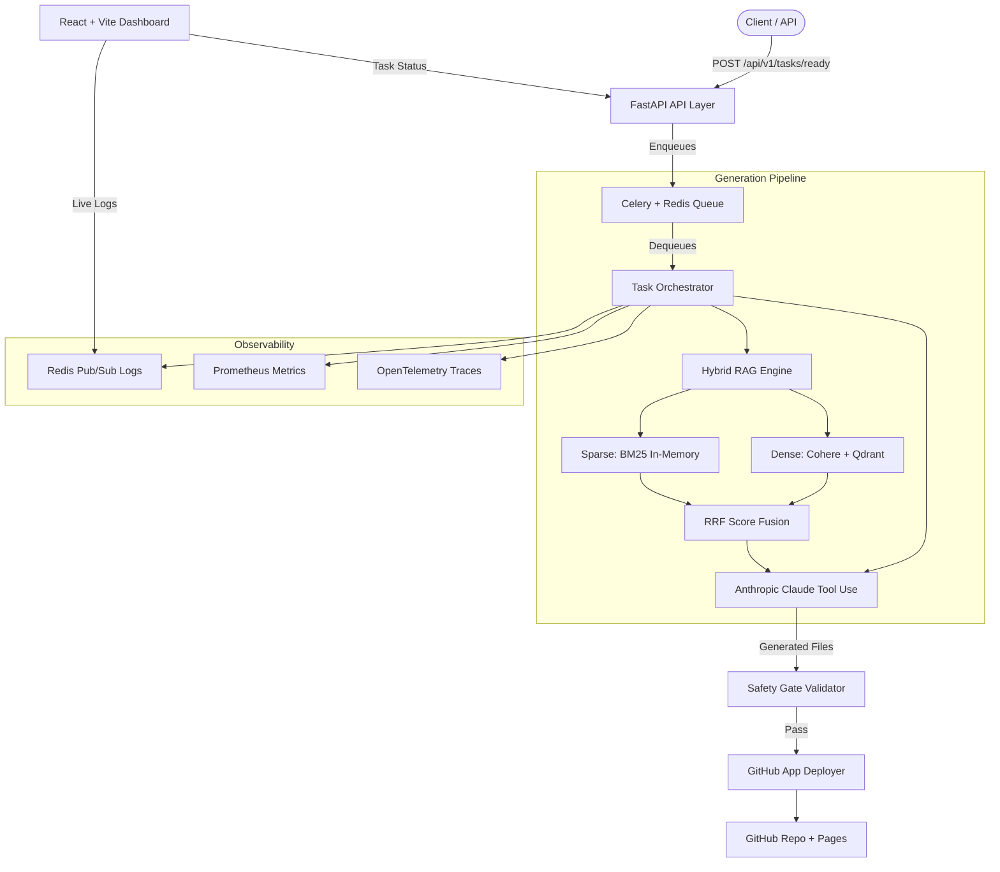

# Agent Command Center
Autonomous AI web app generator with hybrid RAG, Celery task orchestration, GitHub App deployment, and a real-time React dashboard. Zero manual deployment steps.

## Architecture


## System Components

| Component | Role | Stack |
|-----------|------|-------|
| FastAPI API Layer | Request handling, auth, idempotency | FastAPI, SlowAPI, JWT |
| Celery Worker | Durable async task execution | Celery, Redis |
| Anthropic LLM | Structured code generation via Tool Use | Claude claude-sonnet-4-5 |
| Hybrid RAG Engine | Dense + sparse retrieval with RRF fusion | Cohere Embed v3, Qdrant, BM25 |
| GitHub App Deployer | Repo creation + GitHub Pages deployment | GitHub App, GitPython |
| Persistence Layer | Task lifecycle tracking | PostgreSQL, SQLAlchemy Async |
| Real-Time Logs | Per-task log streaming | Redis Pub/Sub, WebSocket |
| Observability | Metrics, traces, dashboards | Prometheus, Grafana, OpenTelemetry |
| Frontend Dashboard | Task management and monitoring UI | React 19, TypeScript, Tailwind v4 |

## Design Decisions

**Celery over FastAPI BackgroundTasks:**  
`BackgroundTasks` runs in the same process and same event loop as the HTTP server. A server restart silently drops all in-flight tasks. Celery workers are separate processes with Redis-backed durability — a restarted worker re-picks the task.

**Anthropic Tool Use over raw completions:**  
Raw completions ask the model to self-impose JSON formatting, which fails ~15% of the time (markdown wrapping, missing keys, truncation). Tool Use forces a schema-validated response through constrained sampling — zero post-processing failures.

**Hybrid RAG (BM25 + dense) with Reciprocal Rank Fusion:**  
Dense embeddings alone miss exact-match lookups (API names, CSS class names, HTML tags). BM25 handles keyword precision. RRF combines both ranked lists into a single score without requiring score normalization across different systems.

**GitHub App over PATs:**  
GitHub Apps issue short-lived installation access tokens with repository-scoped permissions. PATs are org-wide long-lived tokens that are a credential leak risk.

**Redis Pub/Sub for log streaming:**  
File-tailing is single-instance and non-concurrent. Redis channels are multi-producer / multi-consumer — any worker process can publish, any WebSocket connection can subscribe to any task's log channel.

## Quick Start

1. Clone and configure:
```bash
   git clone https://github.com/yourusername/agent-command-center.git
   cd agent-command-center
   cp .env.example .env
   # Fill in: ANTHROPIC_API_KEY, COHERE_API_KEY, GITHUB_*, API_KEY
```
2. Start all services:
```bash
   docker compose up -d --build
```
3. Run migrations:
```bash
   docker compose exec api alembic upgrade head
```
4. Open the dashboard:  
   Navigate to `http://localhost` (Caddy serves frontend on port 80)
5. Submit a task:
```bash
   curl -X POST http://localhost/api/v1/tasks/ready \
     -H "X-Api-Key: your_api_key" \
     -H "Content-Type: application/json" \
     -d '{"task_name": "Portfolio Site", "email": "me@example.com", "nonce": "abc123", "instruction": "Build a dark-themed personal portfolio"}'
```

## API Endpoints

| Endpoint | Method | Auth | Purpose |
|----------|--------|------|---------|
| `/api/v1/tasks/ready` | `POST` | `X-Api-Key` | Submit a new generation task |
| `/api/v1/tasks` | `GET` | `X-Api-Key` | List tasks with pagination and filters |
| `/api/v1/tasks/{id}` | `GET` | `X-Api-Key` | Get task details and deployment URLs |
| `/api/v1/tasks/{id}` | `DELETE` | `X-Api-Key` | Cancel a queued task |
| `/metrics` | `GET` | — | Prometheus metrics scrape endpoint |
| `/health` | `GET` | — | Service health check |
| `/ws/logs?task_id={id}` | `WS` | — | Live log stream for a specific task |

## Environment Variables

| Variable | Required | Description |
|----------|----------|-------------|
| `API_KEY` | ✅ | Master API key (`secrets.token_urlsafe(32)`) |
| `ANTHROPIC_API_KEY` | ✅ | Claude API key for code generation |
| `COHERE_API_KEY` | ✅ | Cohere API key for RAG embeddings |
| `DATABASE_URL` | ✅ | Async PostgreSQL URL |
| `REDIS_URL` | ✅ | Redis URL for queue and pub/sub |
| `GITHUB_USERNAME` | ✅ | GitHub account for deployment |
| `GITHUB_APP_ID` | ✅ | GitHub App installation ID |
| `GITHUB_PRIVATE_KEY_B64` | ✅ | Base64-encoded GitHub App private key |
| `JWT_SECRET` | ✅ | Secret for JWT signing |
| `QDRANT_URL` | ❌ | Qdrant vector DB URL (default: `http://qdrant:6333`) |
| `ALLOWED_ORIGINS` | ❌ | CORS origins (default: `http://localhost:5173`) |

## Tech Stack


## License
MIT