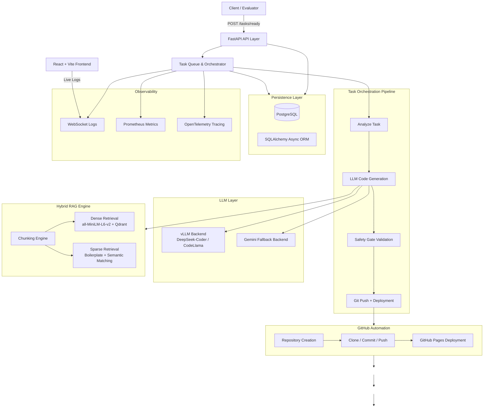

# its-ok-gemini

Autonomous AI SDLC agent capable of generating, revising, deploying, and maintaining applications completely through LLM-driven workflows.

The system handles:
- Code generation
- Repository automation
- Git operations
- GitHub Pages deployment
- Multi-round revisions
- RAG-assisted context retrieval
- Real-time orchestration monitoring

---

# Architecture



---

# System Components

| Component | Role | Stack |
|---|---|---|
| FastAPI API Layer | Request handling and orchestration entrypoint | FastAPI, asyncio |
| Task Orchestrator | Executes generation → deployment lifecycle | Async Workers |
| vLLM Backend | Primary self-hosted inference engine | vLLM |
| Gemini Backend | Cloud fallback generation backend | Gemini API |
| Hybrid RAG Engine | Retrieval-assisted context generation | Qdrant, SentenceTransformers |
| GitHub Automation | Repo creation and deployment management | GitHub API, GitPython |
| Persistence Layer | Task storage and lifecycle tracking | PostgreSQL, SQLAlchemy |
| Observability Layer | Metrics, logs, traces | Prometheus, OpenTelemetry |
| Frontend Dashboard | Monitoring and live logs UI | React, Vite |
| Infrastructure | Containerized runtime | Docker, Docker Compose |

---

# End-to-End Workflow

This workflow represents the complete autonomous lifecycle of the system, from task ingestion and LLM-based code generation to GitHub deployment and iterative revision updates.


---

# Project Structure

```text
app/
├── api/
│   ├── v1/
│   │   ├── tasks.py
│   │   └── metrics.py
│   └── websocket.py
│
├── core/
│   ├── config.py
│   └── logging.py
│
├── db/
│   └── session.py
│
├── models/
│   ├── base.py
│   └── task.py
│
├── services/
│   ├── github_service.py
│   ├── llm_service.py
│   └── rag_service.py
│
├── workers/
│   └── orchestrator.py
│
└── main.py

frontend/
infra/
migrations/
tests/
```

---

# Models Used

| Model | Role |
|---|---|
| DeepSeek-Coder-V2 | Primary code generation |
| CodeLlama-70B | Alternate vLLM backend |
| Gemini 2.0 Flash | Fallback cloud generation |
| all-MiniLM-L6-v2 | Embeddings for semantic retrieval |

---

# API Endpoints

| Endpoint | Method | Purpose |
|---|---|---|
| `/api/v1/tasks/ready` | POST | Create generation task |
| `/api/v1/tasks` | GET | Retrieve task history |
| `/metrics` | GET | Prometheus metrics |
| `/ws/logs` | WS | Live orchestration logs |
| `/health` | GET | Service health check |

---

# Infrastructure

| Service | Purpose |
|---|---|
| Docker | Container runtime |
| Docker Compose | Multi-service orchestration |
| PostgreSQL | Persistent storage |
| Qdrant | Vector database |
| Prometheus | Metrics monitoring |
| vLLM | Local inference serving |

---

# Key Engineering Decisions

**vLLM over direct cloud-only inference:**  
Supports local/self-hosted inference, lower latency, lower operational cost, and backend flexibility through OpenAI-compatible APIs.

**Safety-Gated Revision Pipeline:**  
Prevents destructive LLM rewrites by validating generated code shrinkage before deployment.

**Hybrid Retrieval Architecture:**  
Combines semantic retrieval with structured boilerplate retrieval to improve contextual generation quality.

**Async-first orchestration:**  
All critical operations including database access, HTTP calls, git automation, and inference requests operate asynchronously for better scalability.

**GitHub App Authentication over PATs:**  
Uses installation access tokens with scoped permissions instead of long-lived personal access tokens.

---

# Environment Variables

```env
DATABASE_URL=
DATABASE_SYNC_URL=

GITHUB_USERNAME=
GITHUB_APP_ID=
GITHUB_PRIVATE_KEY_B64=

LLM_BACKEND=
VLLM_ENDPOINT=
VLLM_MODEL=

GEMINI_API_KEY=

QDRANT_URL=
QDRANT_API_KEY=

STUDENT_SECRET=
```

---

# Quick Start

## Backend

```bash
docker compose up --build
```

---

## Frontend

```bash
cd frontend
npm install
npm run dev
```

---

# Tech Stack

- FastAPI
- PostgreSQL
- SQLAlchemy
- Qdrant
- SentenceTransformers
- vLLM
- Gemini API
- GitPython
- Prometheus
- OpenTelemetry
- React
- Docker